# W4 Evidence Pack

> This document contains all implementation evidence, screenshots, logs, architecture notes, and technical decisions for Week 4 evaluation.

---

# Section 1 — Cover

## Group Information

- **Group Number: Group 2**  
- **Project Name: AI ChatBot for GeekBrain**  
- **Repository Link:**  

---

## Team Members

| Full Name | Student ID |
| Ngo Huu Tai | XB-DN26-008 |
| Mai Phuoc Khoa | XB-DN26-033 |
| Nguyen Tien Hoang Thinh | XB-DN26-047 |
| Dang Thi Ngoc Thao | XB-DN26-055 |
| Nguyen Phu Trieu | XB-DN26-070 |
| Nguyen Hung Thinh | XB-DN26-077 |
| Huynh Ba Huan | XB-DN26-106 |
| Nguyen Van Tuan Anh | XB-DN26-112 |
| Le Hoang Viet | XB-DN26-134 |
| Hoang Cong Tri Dung | XB-DN26-148 |

---

## Technical Stack

| Category | Technology |
|---|---|
| LLM | Amazon Bedrock — `amazon.nova-lite-v1:0` (Planning), `amazon.nova-pro-v1:0` (Reasoning) |
| Framework | Python |
| Embedding Model | Amazon Bedrock Knowledge Bases Embedding Model *(managed by Bedrock KB)* |
| Vector Database | Amazon Bedrock Knowledge Bases (managed vector store) |
| Backend | Python, Boto3, SQLite, Requests |
| Frontend | Streamlit |
| Cloud Provider | AWS |
| Observability Tool | Custom Streamlit Observability Dashboard |
| Agent Framework (if any) | Custom Agent Orchestration (Planning → Retrieval → Tool Execution → Reasoning) |

---

# Section 2 — Architecture Overview

## 2.1 System Architecture Diagram

> Insert architecture diagram here (Mermaid / ASCII / Image)

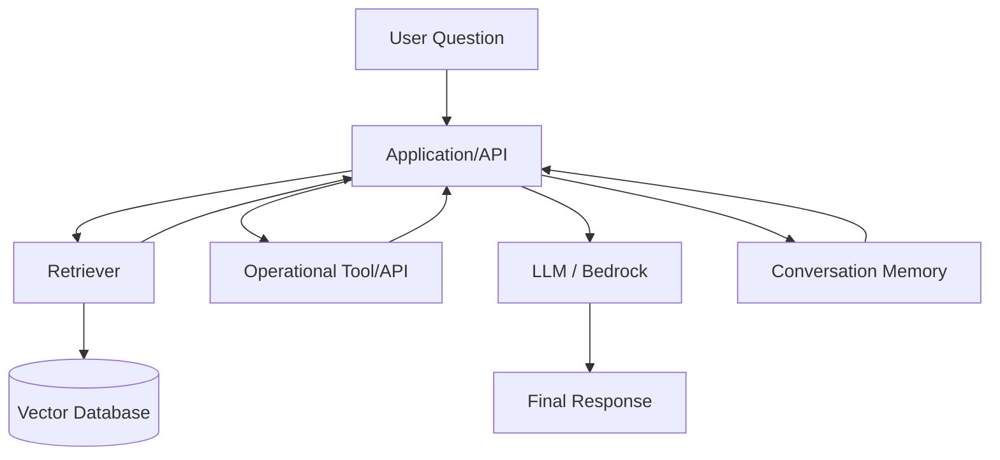
```mermaid
flowchart TD

    User[User Question]
    App[Application/API]
    Retriever[Retriever]
    VectorDB[(Vector Database)]
    Tool[Operational Tool/API]
    LLM[LLM / Bedrock]
    Memory[Conversation Memory]
    Response[Final Response]

    User --> App
    App --> Retriever
    Retriever --> VectorDB
    Retriever --> App

    App --> Tool
    Tool --> App

    App --> Memory
    Memory --> App

    App --> LLM
    LLM --> Response
```

---

## 2.2 Components Description

| Component | Purpose | Notes |
|---|---|---|
| Frontend/UI | Provides chat interface and pipeline visualization for users | Built with Streamlit, includes chat UI and observability dashboard |
| Backend/API | Handles orchestration logic, request processing, retrieval, tool execution, and reasoning | Implemented in Python using custom `GeekBrainAgent` class |
| Retriever | Searches enterprise knowledge base for relevant documents | Uses Amazon Bedrock Knowledge Bases retrieval API with semantic vector search |
| Vector Database | Stores document embeddings for semantic retrieval | Managed internally by Amazon Bedrock Knowledge Bases |
| Tool Layer | Executes external tools such as SQL queries and monitoring APIs | Includes SQLite database queries and REST API metric retrieval |
| LLM | Performs query planning and final reasoning/response generation | Uses Amazon Nova Lite for planning and Amazon Nova Pro for reasoning |
| Memory | Maintains multi-turn conversation context | Implemented using Streamlit session state conversation history |
| Observability | Displays internal pipeline execution and debugging information | Custom Streamlit dashboard showing planning, retrieval, tools, reasoning, and metrics |

---

## 2.3 Data Flow

### End-to-End Request Flow

1. User submits a question through the Streamlit chat interface
2. Backend agent receives the request and initializes pipeline execution
3. Planning LLM generates retrieval queries or multi-step investigation plans
4. Retriever searches Amazon Bedrock Knowledge Base for relevant documents
5. Optional tools are executed:
   - SQLite database queries for historical data
   - REST API calls for live service metrics
6. Retrieved documents and tool outputs are combined into a unified context
7. Reasoning LLM analyzes the context and generates a structured response
8. Final answer and observability details are returned to the user interface
9. Pipeline metrics, retrieved documents, tool outputs, and reasoning traces are displayed in the observability dashboard

---

## 2.4 Running System Evidence

### Screenshot — Running Application

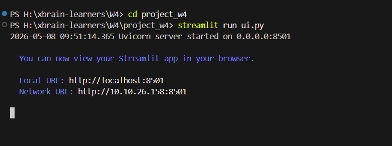
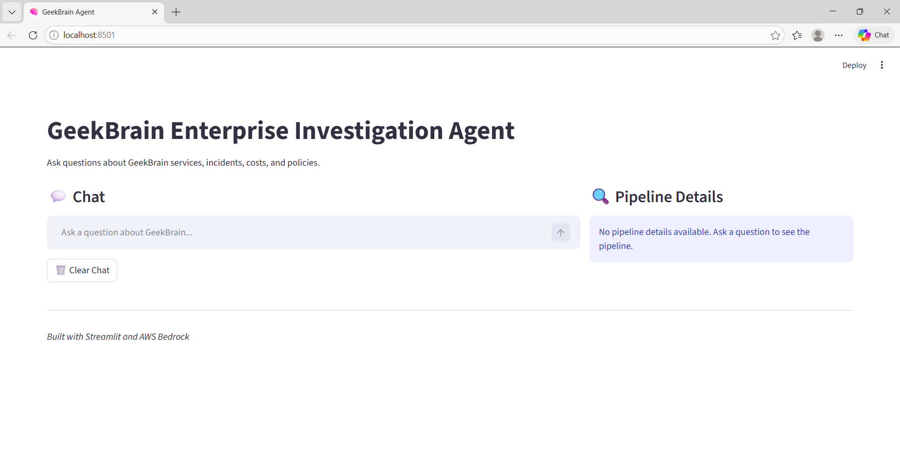

---

# Section 3 — Decision Log

> Document at least 3 important technical decisions made during Week 4.

---

# Decision 1

## What We Chose

- Implemented a multi-stage agent pipeline:
  - Planning
  - Retrieval
  - Tool Execution
  - Reasoning

## Why We Chose It

- A single LLM call was not reliable enough for complex enterprise investigation tasks.
- The assignment required support for:
  - Retrieval
  - Tool usage
  - Multi-step reasoning
  - Observability
- Separating the pipeline into stages improved modularity and debugging.

## What We Learned

- Multi-stage pipelines provide much better control over enterprise AI workflows.
- Query planning significantly improves retrieval quality.
- Structured orchestration makes observability easier to implement.

## What Failed / Did Not Work

- Early versions used only direct retrieval without planning.
- The retriever often missed important context for complex questions.
- Responses became inconsistent for multi-document reasoning tasks.

## Alternative We Switched To

- Added a dedicated planning step using `amazon.nova-lite-v1:0` before retrieval.
- Expanded user queries into multiple semantic retrieval sub-queries.

---

# Decision 2

## What We Chose

- Combined RAG retrieval with external tools:
  - SQLite database queries
  - Live monitoring API calls

## Why We Chose It

- Knowledge Base retrieval alone could not answer dynamic or numerical questions.
- Some questions required:
  - Historical incident data
  - Cost aggregation
  - Current service metrics
- Tool augmentation enabled L3 and L4 capabilities.

## What We Learned

- Hybrid systems are more powerful than retrieval-only architectures.
- Structured data sources are essential for accurate enterprise investigations.
- Tool execution improves factual reliability for operational questions.

## What Failed / Did Not Work

- Initial implementation relied on hardcoded keyword matching.
- Some SQL queries failed because query logic was too rigid.
- Static query templates could not generalize well across user questions.

## Alternative We Switched To

- Improved tool routing logic.
- Added dynamic SQL generation strategies.
- Introduced assessment planning for more complex investigation workflows.

---

# Decision 3

## What We Chose

- Built a custom observability dashboard using Streamlit.

## Why We Chose It

- The project rubric emphasized transparency and internal pipeline visibility.
- We wanted users to inspect:
  - Retrieval results
  - Tool outputs
  - Reasoning inputs
  - Execution timing
- Streamlit allowed rapid UI development with minimal overhead.

## What We Learned

- Observability is critical for debugging AI systems.
- Showing intermediate pipeline states makes failures easier to diagnose.
- Users trust AI systems more when reasoning steps are visible.

## What Failed / Did Not Work

- Early versions only displayed the final answer.
- It was difficult to debug retrieval quality and tool failures.
- Hidden pipeline logic reduced explainability.

## Alternative We Switched To

- Added dedicated pipeline tabs:
  - Planning
  - Retrieval
  - Tool Execution
  - Reasoning
- Displayed metrics such as:
  - Total execution time
  - Number of retrieved documents
  - Number of tools executed

---

# Section 4 — Per-Level Evidence

---

# L1 Evidence — Basic RAG

## Question

```text
[Who is the Team Platform lead?]
```

---

## Expected Behavior

- "Alex Chen" from team_platform.md

---

## Final Response Screenshot

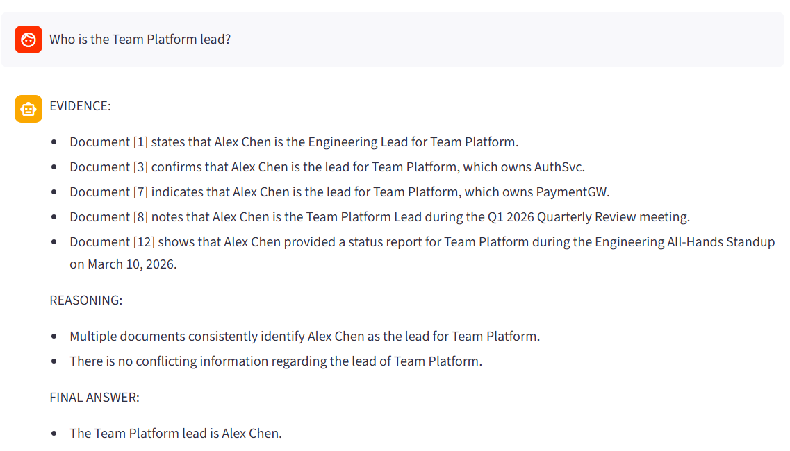

---

## Retrieval Evidence

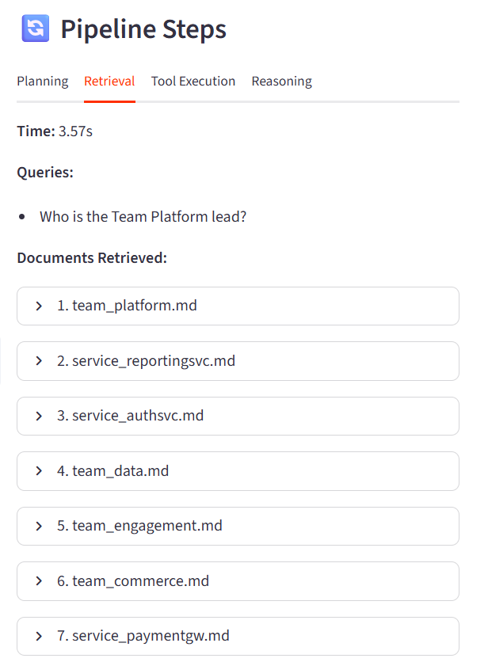
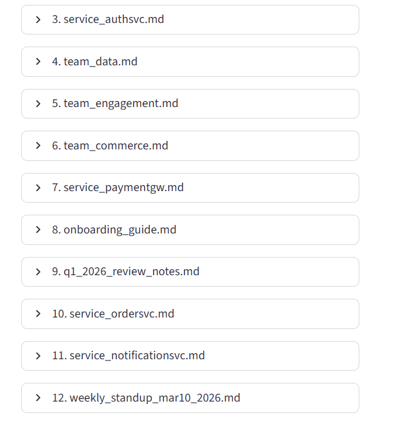
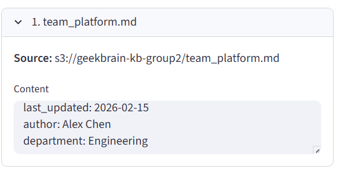

---

---

# L2 Evidence — Multi-Document Reasoning

## Question

```text
[What is PaymentGW's API rate limit?"]
```

---

## Expected Behavior

- System should retrieve both v1 (500) and v2 (1000) and correctly identify v2 as current

---

## Final Response Screenshot

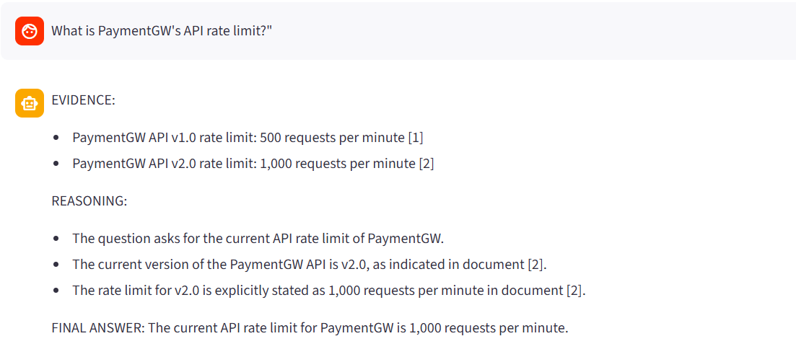

---

## Conflict Resolution Strategy

### How the System Handled Conflicting Information

- The system compares information retrieved from multiple documents and identifies version or policy differences.
- When conflicts are detected, the agent prioritizes:
  1. Newer document versions
  2. More recent timestamps
  3. Explicitly labeled current policies
- During reasoning, the LLM explains why one source is considered more reliable than another.
- Older or deprecated values are still included as supporting evidence for transparency.

---

### Example

| Source | Value |
|---|---|
| Document A | PaymentGW API v1.0 rate limit: 500 requests per minute |
| Document B | PaymentGW API v2.0 rate limit: 1,000 requests per minute |
| Final Answer | The current API rate limit for PaymentGW is 1,000 requests per minute because v2.0 is the latest API version. |

---

## Supporting Logs

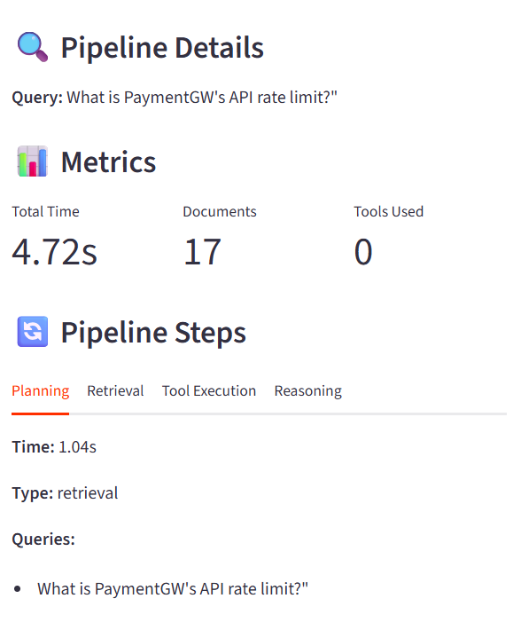
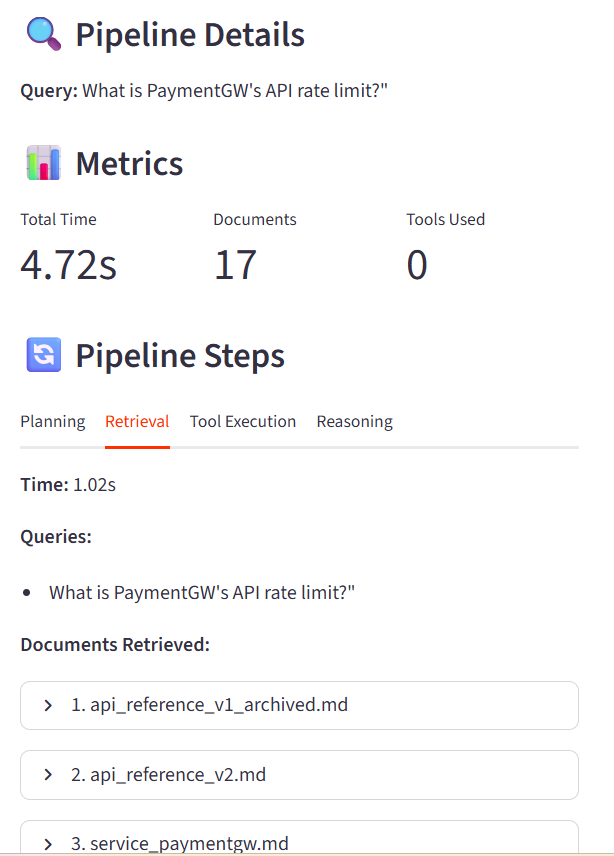
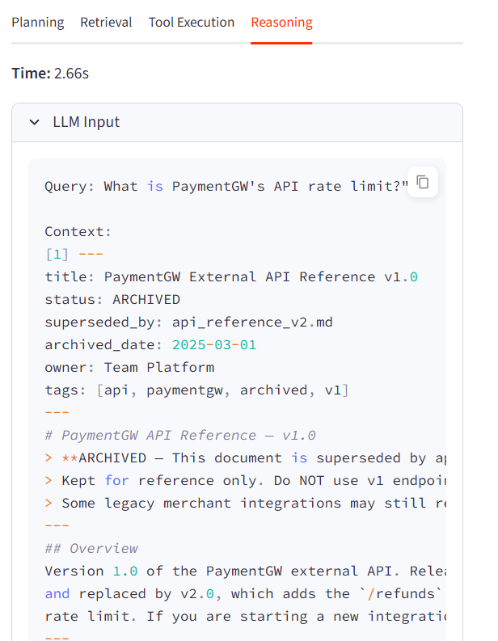
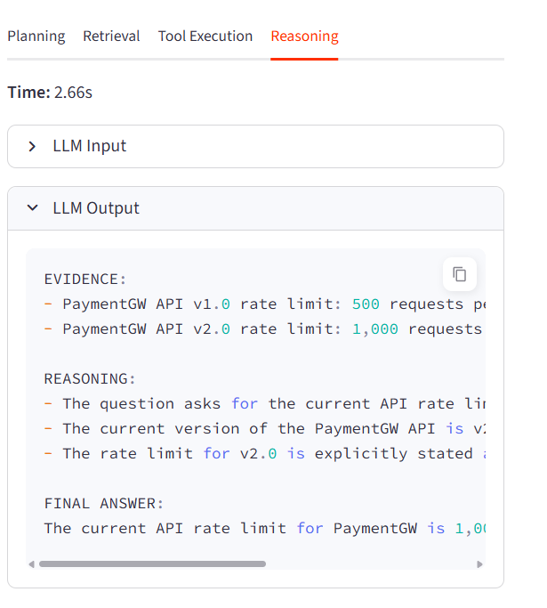

---

# L3 Evidence — Tool-Augmented Reasoning

## Question

```text
[What was PaymentGW's total cost in Q1 2026?]
```

---

## Expected Behavior

- System should call Database Query tool → return $16,500

---

## Final Response Screenshot

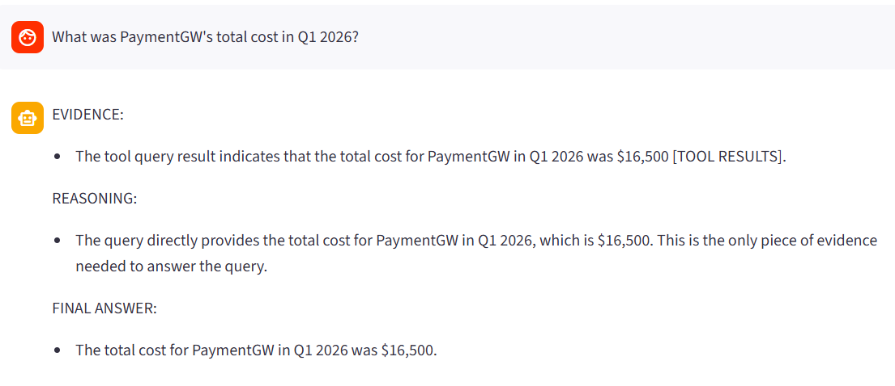

---

## Tool Invocation Evidence

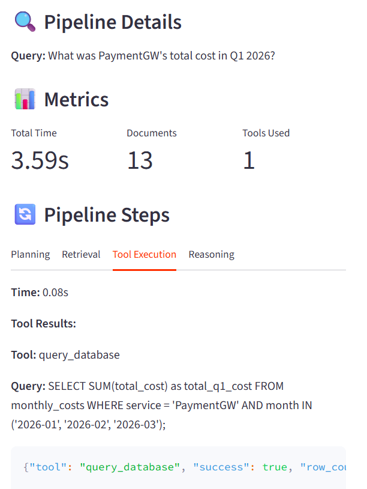

---

## Supporting Logs

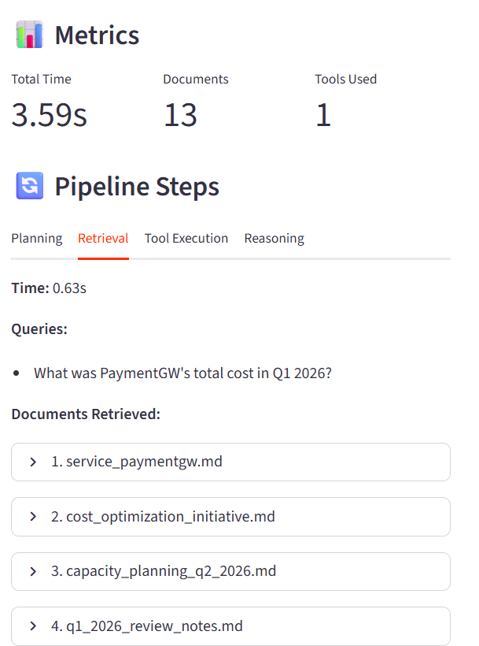
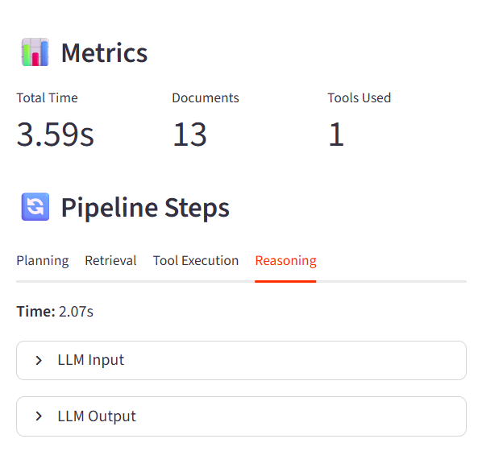

---

# L4 Evidence — Memory / Multi-Turn Conversation

---

## Conversation Example

### Turn 1

```text
User: What is AuthSvc's current request volume?
```

```text
Assistant: The current request volume for AuthSvc is 27,865 requests per minute.
```

---

### Turn 2

```text
User: Is that close to any planned capacity threshold?
```

```text
Assistant: The current request volume for AuthSvc is not close to the planned capacity threshold for Q2 2026.
```

---

### Turn 3

```text
User: How fast has it been growing?
```

```text
Assistant: The growth rate for AuthSvc is approximately 25.6% quarter-over-quarter.
```

---

## Conversation Screenshot

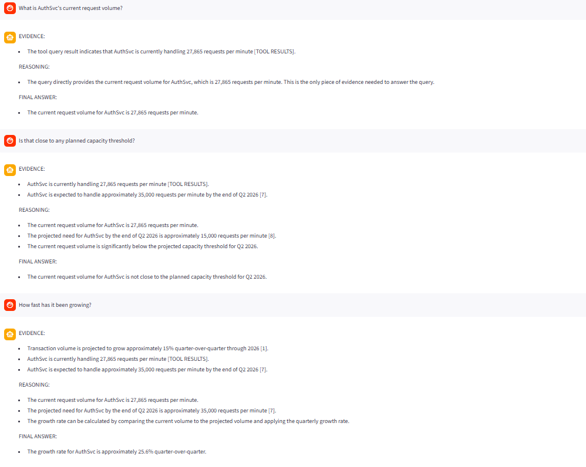

---

## Memory Strategy

### Memory Type Used

- Conversation buffer memory using Streamlit session state
- Chat history stored as a list of user and assistant messages
- Context passed into the reasoning step for multi-turn conversations

### How Context Was Preserved

- Previous conversation messages were stored in `st.session_state.messages`
- Before each new query, earlier messages were passed into the agent as `conversation_history`
- The reasoning LLM received previous user questions and assistant responses as context
- This allowed the system to:
  - Resolve follow-up questions
  - Reference previous answers
  - Maintain conversational continuity

### Limitations

- Memory only persists during the active Streamlit session
- Restarting the application clears conversation history
- Long conversations may increase token usage and latency
- No long-term vector memory or persistent storage was implemented
- Context relevance depends on how much conversation history is included in prompts

---

# AgentCore Evidence (If Used)

---

## AgentCore Architecture

### Managed by AgentCore

- Query orchestration workflow
- Multi-step reasoning pipeline
- Retrieval flow coordination
- Tool execution routing
- Conversation context handling
- Response generation lifecycle

### Custom Components Built by Team

- Custom `GeekBrainAgent` orchestration class
- SQL database integration layer
- Monitoring API integration layer
- Streamlit observability dashboard
- Retrieval result visualization
- Structured reasoning prompt templates
- Conflict resolution strategy
- Assessment-style investigation workflow

---

## Annotated Trace — RAG Only Query

### Question

```text
Who leads Team Platform?
```

---

### Step-by-Step Trace

1. User submits the question through the Streamlit chat interface.

2. The planning LLM generates semantic retrieval queries:
   ```text
   - Team Platform lead
   - Team Platform ownership
   - engineering leadership structure
   ```

3. Amazon Bedrock Knowledge Base retrieves relevant organizational documents.

4. Retrieved documents are assembled into context.

5. The reasoning LLM analyzes the evidence and generates the final answer with citations.

---

### Screenshot Placeholder

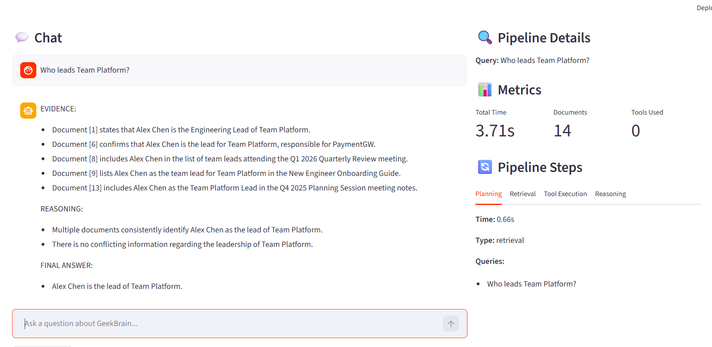

---

## Annotated Trace — Tool-Augmented Query

### Question

```text
What was PaymentGW's total cost in Q1 2026?
```

---

### Step-by-Step Trace

1. User submits the question.

2. The planning LLM determines that historical cost data is required.

3. The tool execution layer runs a SQL query against the SQLite database:
   ```sql
   SELECT SUM(total_cost) as total_q1_cost
   FROM monthly_costs
   WHERE service = 'PaymentGW'
   AND month IN ('2026-01', '2026-02', '2026-03');
   ```

4. Retrieved database results are combined with relevant KB documents.

5. The reasoning LLM generates the final response using both retrieval and tool outputs.

---

### Screenshot Placeholder

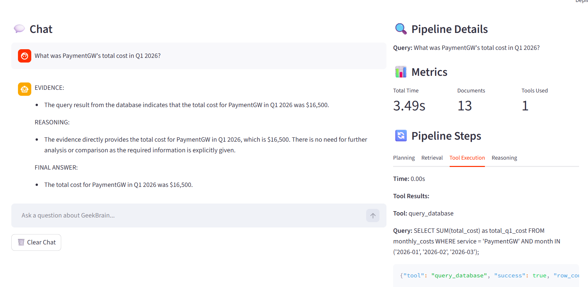

---

## Trace Screenshots

### Screenshot 1 — Planning Stage

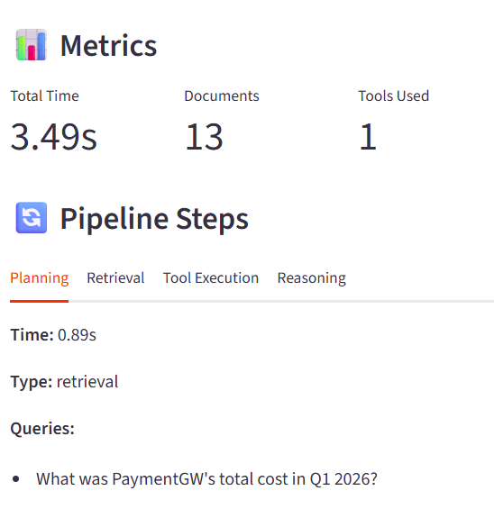

---

### Screenshot 2 — Retrieval Stage

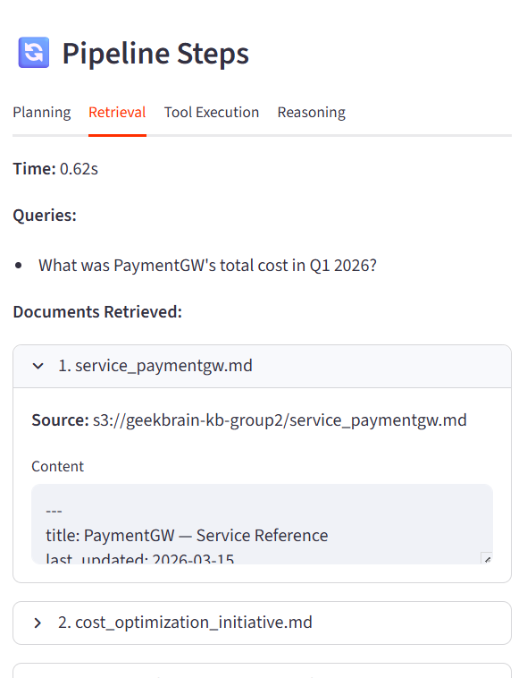

---

### Screenshot 3 — Tool Execution Stage

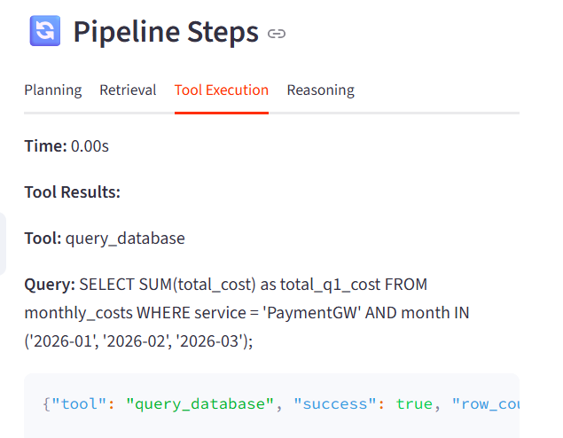

---

### Screenshot 4 — Reasoning Stage

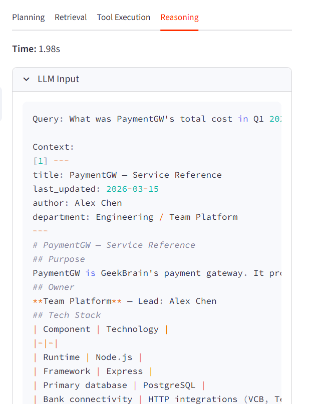
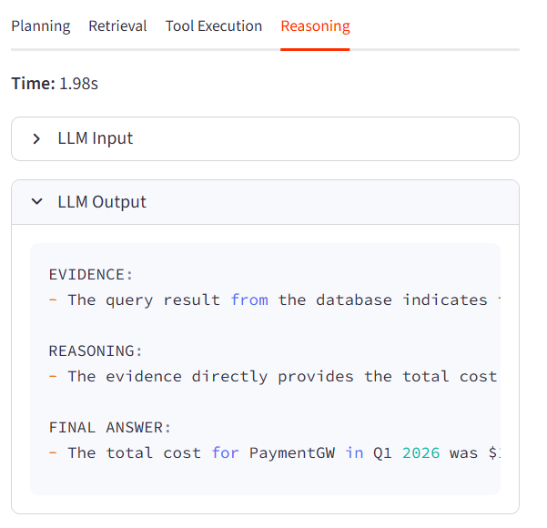

---

# Bonus A — Observability Dashboard

---

## Observability Features

| Feature | Implemented | Notes |
|---|---|---|
| Retrieval Tracking | Yes | Displays retrieval queries, retrieved documents, source file names, and semantic search results |
| Tool Call Tracking | Yes | Shows executed SQL queries, monitoring API calls, tool URLs, and returned JSON outputs |
| Token Usage | No | Token usage tracking was not implemented in the current version |
| Latency Monitoring | Yes | Measures execution time for planning, retrieval, tool execution, reasoning, and total pipeline runtime |
| Error Tracking | Yes | Exceptions from database queries and API calls are captured and displayed in pipeline logs |

---

## Notes

- The observability dashboard was implemented using Streamlit with a multi-tab interface.
- Each pipeline stage is displayed independently for debugging and explainability.
- The dashboard exposes internal agent behavior including:
  - Planning outputs
  - Retrieval results
  - Tool execution details
  - Reasoning prompts and responses
- Intermediate outputs significantly improved debugging of retrieval quality and tool execution failures.
- Execution metrics helped identify performance bottlenecks in the pipeline.
- The observability layer improved transparency, trustworthiness, and maintainability of the system.

---

# Bonus B — Agent Reasoning

---

## Investigation Example

### User Question

```text
Is NotificationSvc in a healthy state? Assess its reliability and flag anything that needs attention.
```

---

### Reasoning Steps

1. The planning LLM generates a multi-step investigation plan.

2. The retriever gathers:
   - SLA policies
   - Incident reports
   - Service ownership documents
   - Reliability guidelines

3. The tool layer retrieves:
   - Current monitoring metrics
   - Historical incidents
   - SLA targets

4. The reasoning LLM analyzes:
   - Latency trends
   - Error rates
   - SLA compliance
   - Operational anomalies

5. The system generates a structured assessment report including recommendations and risk level.

---

## Structured Reasoning Output

```json
{
  "assessment_type": "service_health_assessment",
  "service": "NotificationSvc",
  "data_sources": [
    "Knowledge Base documents",
    "Monitoring API",
    "SQLite incident database"
  ],
  "analysis_steps": [
    "Check current metrics",
    "Review incidents",
    "Compare SLA targets",
    "Identify anomalies"
  ],
  "risk_level": "Medium",
  "recommendations": [
    "Investigate recent latency spikes",
    "Review alerting thresholds",
    "Monitor incident recurrence"
  ]
}
```

---

## Screenshot Evidence

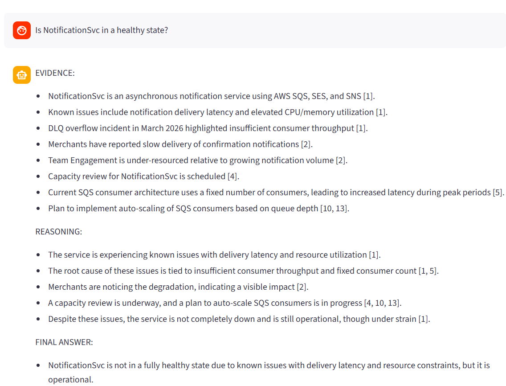

---

## Notes

- The system uses dedicated assessment prompts for investigation-style queries.
- Multi-step reasoning improves operational analysis quality.
- Structured reasoning outputs improve explainability and debugging.
- The architecture supports future extension with additional tools and monitoring systems.

---

# Section 5 — Reflection

## Hardest Level

- L4 — Retrieval + Tools + Memory was the hardest level.
- The biggest challenge was maintaining multi-turn conversation context while still keeping retrieval quality and tool routing accurate.
- Follow-up questions such as “that service”, “their team”, or “the same issue” required the system to correctly resolve references from previous turns.

---

## Why It Was Difficult

- L1 and L2 mainly focused on retrieval quality, while L3 introduced tool calling and numerical accuracy.
- L4 combined all previous challenges together:
  - Retrieval from knowledge base
  - Tool usage (database + monitoring API)
  - Conversation memory
  - Context management
- We had to decide:
  - Which previous messages should remain in memory
  - Which retrieved chunks were still relevant
  - Which tool outputs should be summarized or discarded
- Without careful context engineering, the LLM either:
  - Lost conversation context
  - Retrieved unrelated documents
  - Or hallucinated answers when memory became too large.

---

## Biggest Technical Lesson Learned

- Retrieval quality is more important than model size.
- Good chunking, metadata filtering, and prompt engineering improved accuracy more than simply changing models.
- Tool descriptions must be extremely explicit:
  - vague tool descriptions caused incorrect tool routing
  - structured JSON outputs reduced hallucinations significantly
- Observability was critical:
  - logging retrieved chunks
  - showing tool calls
  - displaying generated SQL queries
  helped us debug failures much faster.
- Memory systems require summarization:
  - storing the entire conversation history quickly polluted the context window
  - summarizing important entities and previous answers worked better.

---

## What We Would Improve With One More Day

- Add reranking for retrieved chunks to improve relevance.
- Improve hybrid search by combining BM25 keyword search with vector retrieval.
- Add retry handling and validation for tool failures.
- Improve conversation memory using entity-based memory instead of raw chat history.
- Add caching for repeated retrieval queries.
- Build a better dashboard for:
  - retrieval traces
  - tool execution logs
  - token usage
  - latency monitoring.
- Fine-tune prompts for conflict resolution between documents with different versions.

---

# Section 6 — Additional Way Build ChatBot — Using Action Group / Lambda

> This section describes an alternative chatbot architecture using AWS Bedrock Agents with Action Groups and AWS Lambda functions.

---

# 5.1 Objective

The purpose of this implementation approach is to extend chatbot capabilities beyond static RAG retrieval by enabling:

- Real-time operational data access
- External API integration
- Dynamic calculations
- Structured tool invocation
- Automated workflows

Instead of relying only on vector retrieval, the chatbot can invoke backend functions through AWS Lambda using Bedrock Action Groups.

---

# 5.2 High-Level Architecture

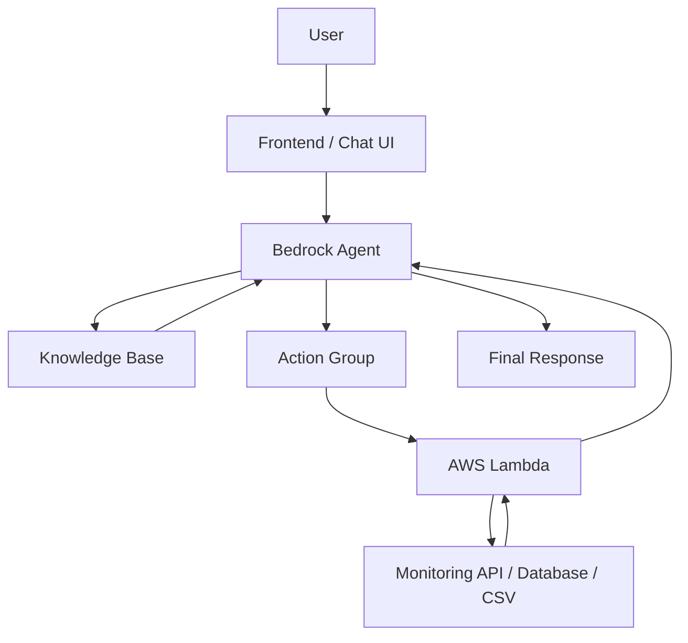
```mermaid
flowchart TD

    User[User]
    UI[Frontend / Chat UI]
    Agent[Bedrock Agent]
    KB[Knowledge Base]
    AG[Action Group]
    Lambda[AWS Lambda]
    API[Monitoring API / Database / CSV]
    Response[Final Response]

    User --> UI
    UI --> Agent

    Agent --> KB
    KB --> Agent

    Agent --> AG
    AG --> Lambda

    Lambda --> API
    API --> Lambda

    Lambda --> Agent
    Agent --> Response
```

---

# 5.3 Core Components

| Component | Purpose |
|---|---|
| Bedrock Agent | Main orchestration layer |
| Knowledge Base | Handles RAG retrieval |
| Action Group | Defines callable tools/functions |
| AWS Lambda | Executes backend logic |
| Monitoring API | Provides live operational data |
| Frontend UI | User interaction layer |

---

# 5.4 Action Group

Action Groups allow Amazon Bedrock Agents to invoke backend functionality automatically based on user intent.

In this system, two AWS Lambda functions were implemented as backend tools:

| Lambda Function | Purpose |
|---|---|
| `csv-tool-lambda` | Query operational CSV datasets such as SLA, incidents, cost reports, and metrics |
| `api-tool-lambda` | Retrieve live monitoring information such as service status, uptime, alerts, and latency |

---

# 5.5 Evidence

## Architecture Screenshot

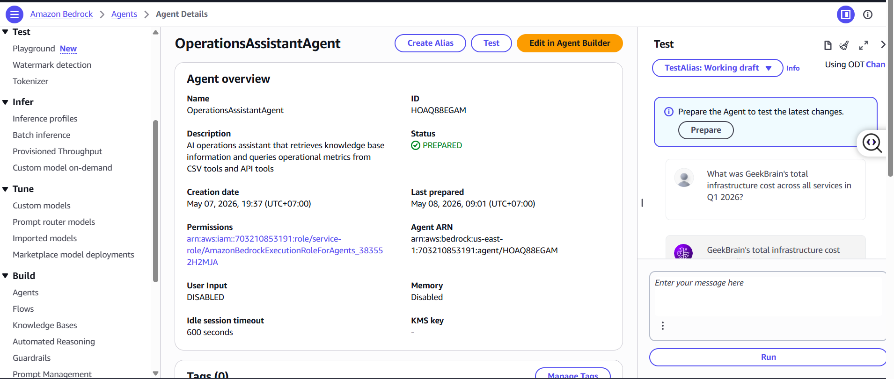
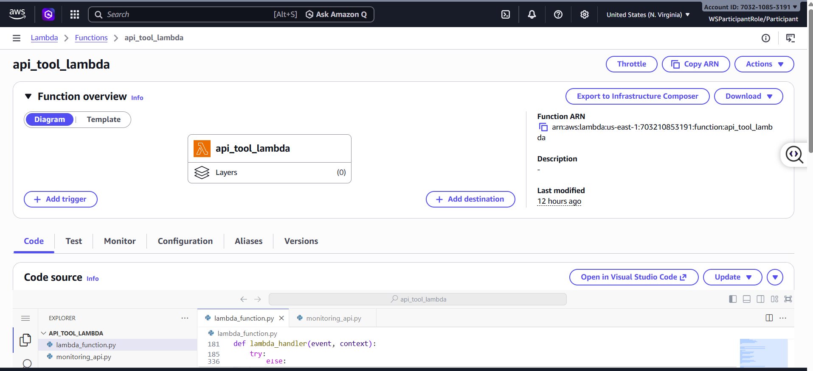
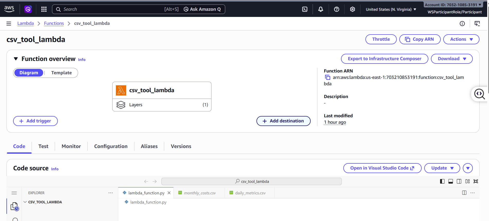
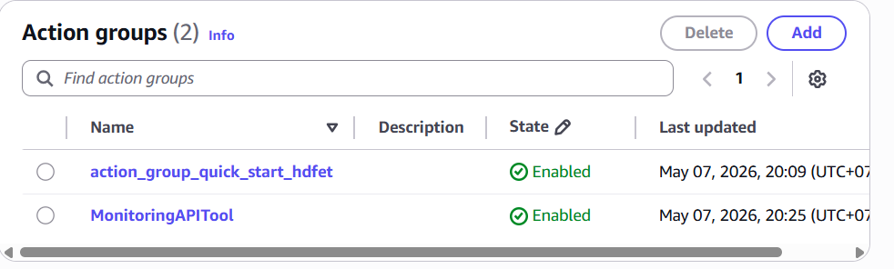

---

## Lambda Logs

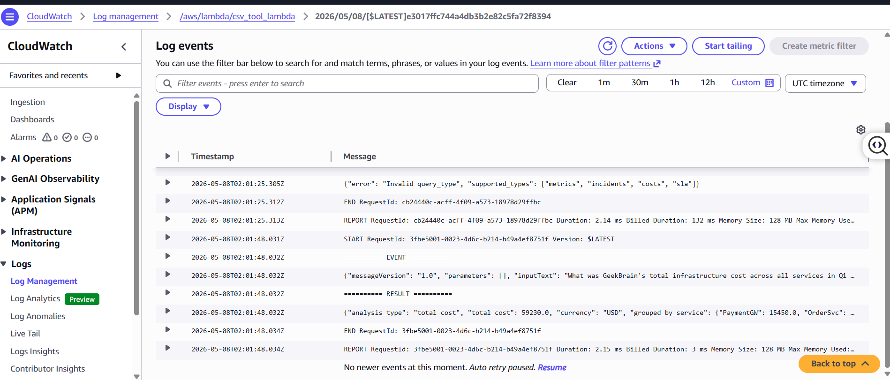
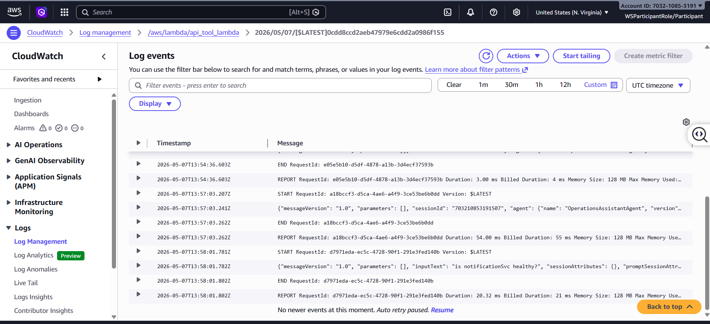

---

## Result Screenshot

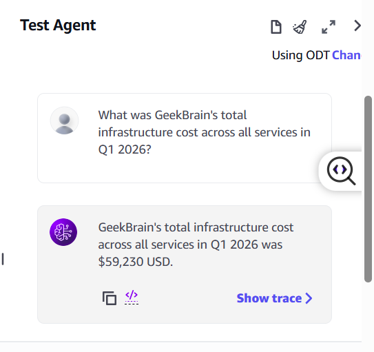

---

# 5.6 Reflection

Using Action Groups with Lambda significantly improved the chatbot’s ability to answer dynamic operational questions.

Compared to pure RAG systems:

- Responses were more accurate for real-time data
- Numerical answers became verifiable
- The system could integrate external services
- Operational observability became easier

However, the architecture also introduced additional complexity in:

- Tool orchestration
- Error handling
- Lambda permissions
- API latency management

Overall, this approach provided a more production-ready architecture for enterprise AI assistants.

---
